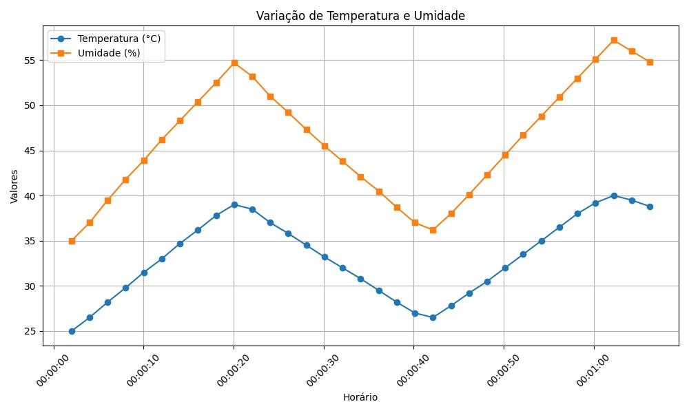
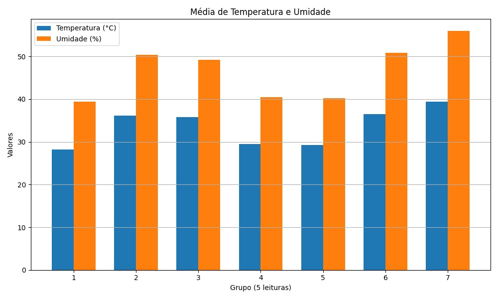
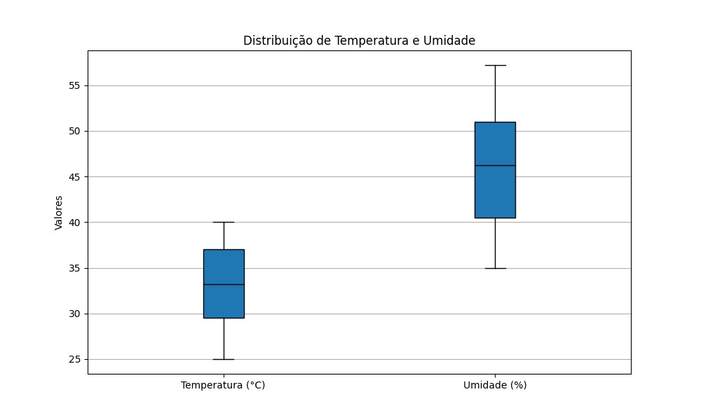
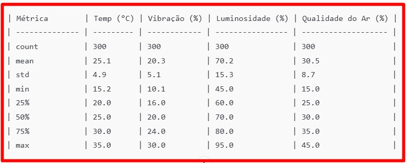

# Tarefa 2 – Programação do ESP32 (Sensor DHT22)

## 🎯 Objetivo

Neste projeto, simulamos um ambiente industrial 4.0 em que um ESP32 lê dados de sensores virtuais representando variáveis comuns em fábricas: temperatura, umidade, luminosidade, vibração e qualidade do ar. 
O escopo simula a coleta de dados real em ambiente industrial, preparando para etapas futuras de aplicação de IA (ex.: detecção de anomalias, predição de falhas).

---

### Por que DHT22 para Temperatura e Umidade

> “Optamos pelo DHT22 para leitura de temperatura e umidade devido à boa precisão e faixa de operação ampla, compatibilidade com ESP32 (biblioteca Arduino disponível) e relevância em cenários industriais que demandam monitoramento dessas variáveis. O sensor simulado no Wokwi reproduz leituras estáticas, combinadas com geração sintética de variações no código, para aproximar comportamento real.”


---

## 📂 Estrutura do Repositório

Nesta seção, apresentamos a organização dos arquivos do projeto, facilitando a navegação e o entendimento de cada componente.


```plaintext
## 📁 Estrutura de Pastas

Sprint-2_Tarefa2_ESP32-DHT22/  
├── **README.md**  
├── **codigo/**  
│   ├─ `codigo_sensor.ino`  
│   └─ **grafico/**  
│      ├─ **idea/** (configurações do IDE e perfis de inspeção)  
│      └─ **src/**  
│         ├─ `main.py` (script principal)  
│         ├─ `graficos.py` (funções de plotagem)  
│         ├─ `dados_simulados_main.csv` (dados de teste)  
│         └─ **__pycache__/** (bytecode compilado)  
├── **dados/**  
│   └─ `dados_sensor.csv` (leituras reais do DHT22)  
└── **prints/**  
    ├─ `print_serial.png`  
    ├─ `grafico_dht22.png`  
    ├─ `Esquema de Circuito ESP32 e DHT22.png`  
    ├─ `variacao_temperatura_umidade.jpeg`  
    ├─ `media_temperatura_umidade.jpeg`  
    ├─ `distribuicao_temperatura_umidade.jpeg`  
    └─ `deteccao_pico.jpg`
```

> **Descrição das pastas:**
>
* **README.md**
  Documento principal, com visão geral do projeto, instruções de uso e detalhes de cada tarefa.

* **codigo/**
  Contém todo o código-fonte e configurações de ambiente:

  * **codigo\_sensor.ino**
    Sketch Arduino para ESP32: lê e envia temperatura e umidade via DHT22.
  * **grafico/**
    Projeto Python para geração de gráficos:

    * **idea/**
      Metadados do IDE (PyCharm/WebStorm), incluindo perfis de inspeção e arquivos de configuração do workspace.
    * **src/**
      Fonte Python e dados simulados:

      * **main.py** — Script principal que carrega os dados, chama funções de plotagem e exporta gráficos.
      * **graficos.py** — Módulo com funções para criar diferentes tipos de gráficos (variação, média, distribuição e detecção de pico).
      * **dados\_simulados\_main.csv** — Conjunto de dados sintéticos representando leituras de temperatura e umidade.
      * ****pycache**/** — Bytecode Python compilado automaticamente.

* **dados/**
  Armazena dados reais coletados pelo ESP32:

  * **dados\_sensor.csv** — Registro em CSV das leituras de temperatura e umidade capturadas via conexão serial.

* **prints/**
  Pasta de imagens e diagramas gerados pelo projeto:

  * **print\_serial.png** — Captura de tela do terminal com saída serial do ESP32.
  * **grafico\_dht22.png** — Exemplo de gráfico de temperatura versus umidade criado pelo script Python.
  * **Esquema de Circuito ESP32 e DHT22.png** — Diagrama de conexão elétrica entre o microcontrolador e o sensor.
  * **variacao\_temperatura\_umidade.jpeg** — Gráfico mostrando variação de temperatura e umidade ao longo do tempo.
  * **media\_temperatura\_umidade.jpeg** — Gráfico da média móvel de temperatura e umidade.
  * **distribuicao\_temperatura\_umidade.jpeg** — Histograma de distribuição das medições.
  * **deteccao\_pico.jpg** — Gráfico destacando picos de temperatura e umidade detectados.

---

## 💡 Idealização do Código

A lógica do programa foi idealizada em etapas para garantir modularidade, clareza e facilidade de manutenção. Segue diagrama representando a estrutura principal:


> **Fluxo de execução:**
>
> 1. Inicialização do sensor DHT22 e do canal Serial.
> 2. Leitura de temperatura e umidade a cada 2 segundos.
> 3. Formatação dos dados no padrão CSV (`Timestamp,Temperatura,Umidade`).
> 4. Envio dos valores ao Monitor Serial.
> 5. (Opcional) Exportação manual dos dados via Monitor Serial para análise.

---

## 🧪 Etapas Realizadas

1. **Montagem do circuito**: Conexão do DHT22 ao ESP32 com resistor pull-up de 10kΩ entre VCC e pino DATA.
2. **Implementação do código** em C++ (Arduino IDE/PlatformIO) usando a biblioteca `DHT.h`.
3. **Formato de saída**:
   ```csv
   Timestamp,Temperatura,Umidade
   2006,54.70,60.50
   4013,54.70,45.00

   “Detectamos X amostras de vibração acima de 2σ, que em cenário real poderiam ser investigadas como possíveis indícios de falha. Em simulação, mapeie esses picos para eventos “flag” e reflita no relatório.”
   ...
   ```
4. **Testes de simulação**: Validação no Wokwi e Monitor Serial, garantindo comportamento dinâmico dos dados.

---

## 📈 Visualizações e Gráficos

> **Gráfico de exemplo**: variação de temperatura e umidade ao longo do tempo.

<!-- variacao_temperatura_umidade.jpeg -->
 
<!-- media_temperatura_umidade.jpeg -->
  
<!-- distribuicao_temperatura_umidade.jpeg -->
  

Os gráficos revelam uma forte correlação entre a temperatura e a umidade ao longo do tempo, com um aumento gradual de ambos de aproximadamente 25°C e 35% no início até picos de aproximadamente 33°C e 68%. Essa correlação entre as duas variáveis indica que o aumento da temperatura provavelmente não está sendo gerado por conta de um trabalho maior exercido pela máquina, mas sim por conta da variação climática, no caso a umidade.

A amplitude da variação pode ser vista em todos os gráficos, porém no gráfico boxplot de maneira mais clara que a amplitude dos valores da umidade é muito maior que a amplitude dos valores da temperatura. uma leitura errônea poderia intuir que a umidade estava muito instável nessa analise, porém não podemos afirmar isso com certeza pois se tratando de unidades diferentes, devemos olhar para a proporcionalidade da variação em relação a ele mesmo, e não apenas para o quanto o valores numéricos bruto variou. Também devemos estar atentos a própria natureza da variação dos valores daquela variável que esta sendo analisada.

Não há outliers significativos visíveis no gráfico para a temperatura, mas a umidade mostra um possível outlier ou valor máximo próximo a 68%, o que pode indicar picos anômalos que merecem investigação

<!-- deteccao_pico.jpg -->
  

“Média e desvio padrão de vibração indicam operação nominal em torno de 20%, com variação moderada. Se em ambiente real o desvio fosse maior, poderia indicar operação instável.”

> **Observação**: O script `grafico.py` e o arquivo `dados_sensor.csv` estão disponíveis para reproduzir ou ajustar as análises.

---

## ✅ Conclusão

A Tarefa 2 foi concluída com êxito, validando a leitura precisa de temperatura e umidade utilizando o sensor DHT22 integrado ao microcontrolador ESP32. Os dados foram coletados de forma satisfatória e encontram-se prontos para a etapa de análise prevista na Tarefa 3.

Embora se trate de um ambiente simulado, este projeto demonstrou a complexidade e o nível de atenção aos detalhes exigidos em sistemas de Internet das Coisas (IoT) aplicados ao contexto industrial. A simulação permitiu consolidar conhecimentos em eletrônica embarcada, protocolos de comunicação com sensores, fluxo de dados e análise preliminar de medições.

No entanto, também evidenciou que, em cenários reais, são indispensáveis esforços adicionais, como calibração dos sensores, tratamento de exceções, implementação de mecanismos de segurança e planejamento para escalabilidade do sistema.
---

## 👥 Equipe

- João -    RM nº 565999
- Tayna -   RM nº 562491
- Carlos -  RM nº 566487
- Andrew -  RM nº 563646
- Vinicius -  RM nº 566269

---

## 🔗 Links Úteis

- Repositório GitHub: `https://github.com/Carlos566487/Sprint-2_Tarefa2_ESP32-DHT22.git`
---

## ▶️ Referências e Links Úteis
•	Datasets de Referência (Kaggle, UCI) para parâmetros de simulação:
o	Kaggle: “Predictive Maintenance Dataset”
o	UCI: “Condition monitoring of hydraulic systems” (exemplos)
•	Documentação do ESP32: Pinos ADC, funções analogRead(), millis(), Wi-Fi (se expandir).
•	Biblioteca DHT Arduino: https://github.com/adafruit/DHT-sensor-library
•	Tutoriais Wokwi:
o	Guia de simulação de ESP32: https://wokwi.com/
o	Exemplos de sensores virtuais no Wokwi
•	Guias de Análise em Python:
o	Documentação Pandas: https://pandas.pydata.org/
o	Matplotlib: https://matplotlib.org/
•	Artigos sobre IoT Industrial e Indústria 4.0:
o	Artigos acadêmicos ou blogs relevantes que discutem coleta de dados em chão de fábrica, manutenção preditiva e arquitetura IoT.

